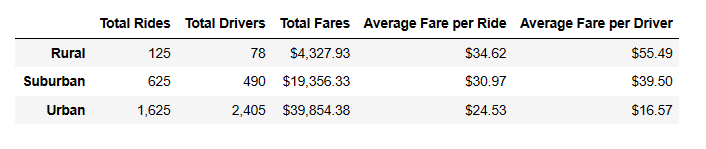
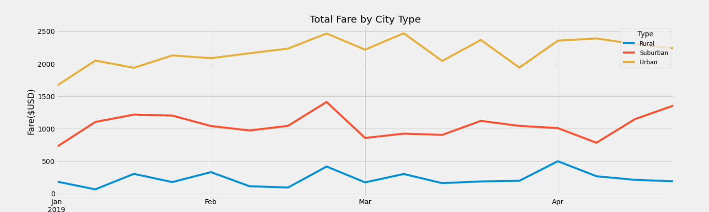

# PyBer_Analysis

## Overview of Project
The purpose of this project was to read in 2 CSV files and merge to 1 dataframe, create a summary dataframe by performing count, sum and mean operations using the groupby function, and finally plot the compiled fare totals by week by city type to a multi line chart to visualize the results.

## Results
 At first glance, the results of the PyBer Analysis seemed to demonstrate the concept of economies of scale.  The lower the population of a city type, the lower the demand
 for the service and the higher the average fare became for both averages.  Urban areas created greater demand for the service, this drew more drivers to the service
 and therefore, the average cost per trip and per driver was lower in urban areas compared to less populated areas.  However, it was hard to understand given this dataset if
 distance had anything to do with the average cost per trip as the trip distance was not available.  It is possible that rural trips lead to greater distances being driven which
 also could drive up trip cost.
 

 
 Overall, the 3 city types tended to follow very similar patterns of peaks and valleys over the 4 month timespan.
 

## Summary

In summary, I would recommend the following:
1.  Further analysis should be done with ride data to pull in ride distance.  This would allow us to analyze the cost per mile between rural and urban settings to see how similar
    costs are in different city settings and remove any disparities that may be keeping rural riders from accessing this service.
    
2.  94% of revenue is coming from urban and suburban settings so growth should still focus no these markets so incentivizing drivers in these markets may help as the average
    fare per driver is significantly lower in these city settings and may be discouraging to drivers.

3.  Over the 4 month period rural ridership stayed relatively stagnant with little growth, however, urban and suburban trends are upward which show higher adoption of the service
    and projected future growth.
